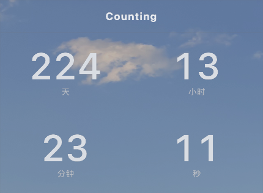
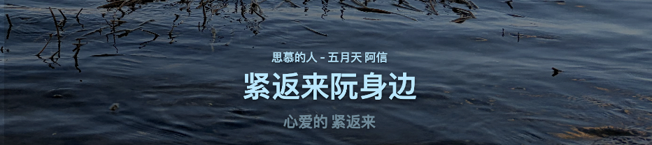
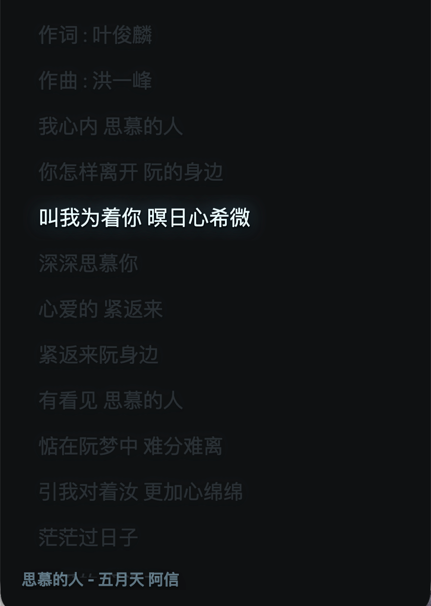

# obs-web-widgets

<table>
  <tr>
	<td>Countdown</td>
	<td>Lyrics</td>
	<td>Lyrics AMLL</td>
  </tr>
  <tr>
	<td></td>
	<td></td>
	<td></td>
  </tr>
</table>

macOS-only local web widgets for OBS Browser Source.

The CLI starts one localhost service at `127.0.0.1:17363` and serves:

- `/config`: local configuration page
- `/lyrics`: simple lyrics overlay
- `/amll`: Apple Music-like Lyrics widget
- `/countdown`: countdown widget

Now Playing metadata is read through a bundled `mediaremote-adapter` Perl bridge that loads
macOS `MediaRemote.framework`.

## Install

Homebrew:

```bash
brew tap wesleyel/obs-web-widgets https://github.com/wesleyel/obs-web-widgets
brew install obs-web-widgets
obs-web-widgets --open
```

This repository can be used directly as a custom tap. The explicit Git URL is required because
Homebrew's short `brew tap wesleyel/obs-web-widgets` form maps to
`https://github.com/wesleyel/homebrew-obs-web-widgets`.

To run it in the background through Homebrew Services:

```bash
brew services start obs-web-widgets
brew services stop obs-web-widgets
tail -f "$(brew --prefix)/var/log/obs-web-widgets.log"
```

Until the first tagged release exists, install from the formula's `HEAD` target:

```bash
brew tap wesleyel/obs-web-widgets https://github.com/wesleyel/obs-web-widgets
brew install --HEAD obs-web-widgets
```

Development checkout:

```bash
uv sync
uv run obs-web-widgets --open
```

The in-app autostart switch writes `~/Library/LaunchAgents/local.obs-web-widgets.plist` pointing to
the currently running CLI executable. Homebrew Services instead uses the service block in
`Formula/obs-web-widgets.rb`.

Now Playing requires the system `perl` command, available at `/usr/bin/perl` on macOS.

## OBS URLs

Add Browser Source entries in OBS:

```text
http://127.0.0.1:17363/lyrics
http://127.0.0.1:17363/amll
http://127.0.0.1:17363/countdown
```

The pages use transparent-friendly dark overlays. AMLL loads
`@applemusic-like-lyrics/core@0.4.2` from `esm.sh`, so that OBS source needs network access.

## Configuration

Configuration is stored at:

```text
~/Library/Application Support/obs-web-widgets/config.json
```

Fields:

- `lyricOffset`: lyrics offset in seconds
- `nowPlayingBundleID`: target Now Playing app bundle id, default `com.netease.163music`
- `pollInterval`: Now Playing polling interval in seconds
- `countdownName`: countdown title
- `countdownTarget`: `YYYY-MM-DD` or `YYYY-MM-DD HH:MM:SS`

CLI options:

```bash
obs-web-widgets --host 127.0.0.1 --port 17363
obs-web-widgets --config ~/Library/Application\ Support/obs-web-widgets/config.json
obs-web-widgets --open
```

## API

Supported endpoints:

```text
GET  /api/state
GET  /api/countdown
GET  /api/amll/lines
GET  /api/config
POST /api/config
GET  /api/autostart
POST /api/autostart
GET  /events
```

`POST /api/config` accepts JSON using the same field names as the config file.
`POST /api/autostart` accepts `{"enabled": true}` or `{"enabled": false}`.

## Development

```bash
uv sync --all-groups
uv run ruff check .
uv run pytest
uv build
```

CI runs lint, tests, and Python package build on macOS. Tagged builds upload the Python
distribution artifacts from `dist/`; no `.app`, PyInstaller bundle, code signing, or notarization
is part of this project.

The Homebrew formula lives in `Formula/obs-web-widgets.rb`. When releasing a new version, update the
project version, the formula `tag` and `version`, then push the matching `vX.Y.Z` tag.
